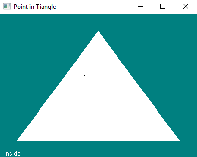
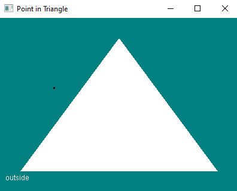
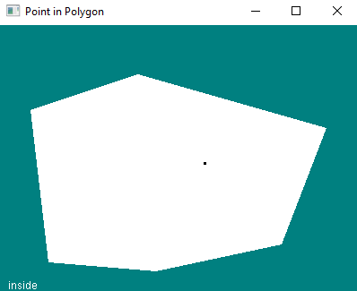
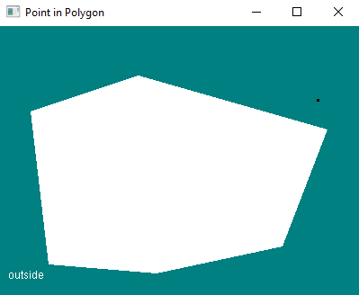

# Point in polygon test with same side technique

<a href = "https://blackpawn.com/texts/pointinpoly/" target = "_blank">Same side technique</a> algorithm in OpenGL. This algorithm checks if the clicked area is in the inside or the outside of a triangle. A polygon with more than three coordinates is divided into triangles and the same technique is used as well.

<b>Triangle:</b>

<b>Polygon:</b>

Just know I was about to burn my pc while trying to get this to work
